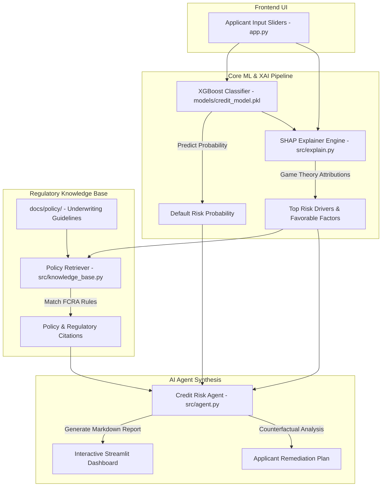

# Credit Risk Explainability & AI Underwriting Agent 💳🤖

[](https://www.python.org/)
[](https://xgboost.readthedocs.io/)
[](https://shap.readthedocs.io/)
[](https://streamlit.io/)
[](LICENSE)

An end-to-end Explainable AI (XAI) and RAG-driven AI Agent platform that transforms black-box machine learning credit scoring models into transparent, compliant, and actionable credit underwriting decisions.

---

## 📌 Executive Overview

In financial credit risk assessment, machine learning models like XGBoost provide high predictive accuracy for default risks but act as "black boxes". Under regulations such as the **Fair Credit Reporting Act (FCRA)**, financial institutions are legally required to provide clear, principal adverse reasons whenever a credit application is rejected or subject to unfavorable terms.

This project solves the explainability gap by combining:
1. **Gradient-Boosted Credit Risk Scoring**: XGBoost classifier trained to predict default probabilities.
2. **Game-Theoretic SHAP Attributions**: Feature-level explanation engine extracting precise risk-increasing and risk-reducing drivers for individual applicants.
3. **Regulatory Policy Knowledge Base**: Rule retrieval engine indexing credit underwriting guidelines (DTI caps, credit score tiers, delinquency windows).
4. **AI Underwriting Agent**: Automated decision synthesizer generating human-readable compliance reports and step-by-step applicant remediation advice.
5. **Interactive Web Dashboard**: Streamlit application with real-time sliders, visual SHAP plots, and "What-If" scenario simulators.

---

## 🏗️ System Architecture



---

## 📁 Project Structure

```
credit-risk-explainability/
├── .gitignore                      # Git ignore configurations
├── README.md                       # Complete project documentation
├── app.py                          # Streamlit web application dashboard
├── requirements.txt                # Python package dependencies
├── data/
│   ├── raw/                        # Raw synthetic & credit dataset
│   └── processed/                  # Normalized train/test feature matrices
├── docs/
│   └── policy/
│       └── credit_underwriting_policy.md # Credit policy & FCRA regulatory rules
├── models/
│   ├── credit_model.pkl            # Trained XGBoost binary model
│   ├── scaler.pkl                  # StandardScaler artifact
│   └── feature_names.json          # Feature schema JSON
├── notebooks/
│   ├── 01_model_training.ipynb     # Model training & EDA Jupyter Notebook
│   └── scripts/                    # Integrated pipeline scripts
│       ├── eda.py                  # Exploratory Data Analysis script
│       ├── model_training.py       # Multi-model evaluation (LogReg, RF, XGB)
│       ├── shap_explainability.py  # Standalone SHAP analysis script
│       └── threshold_tuning.py     # Precision-Recall & threshold tuning
└── src/
    ├── __init__.py
    ├── explain.py                  # SHAP Explainability Engine & Counterfactuals
    ├── knowledge_base.py           # Policy Knowledge Base & RAG retriever
    └── agent.py                    # Decision Report Synthesizer Agent
```

---

## 🔬 Technical Components & Methodology

### 1. Machine Learning Risk Model (`src/` & `models/`)
* **Algorithm**: XGBoost Classifier with `scale_pos_weight` imbalance handling.
* **Features**:
  * `income`: Annual applicant income ($)
  * `credit_score`: FICO credit score (300 - 850)
  * `debt_to_income`: Total monthly debt obligations divided by monthly income (DTI)
  * `delinquencies_2yrs`: Number of 90+ day past due delinquencies in past 24 months
  * `recent_inquiries`: Number of hard credit inquiries in past 6 months
  * `loan_amount`: Total requested loan amount ($)
  * `employment_years`: Length of continuous employment
  * `age`: Applicant age
* **Risk Classification Tiers**:
  * **Tier 1 (Low Risk, Prob < 20%)**: Automatic Approval (Preferred Rates)
  * **Tier 2 (Moderate Risk, 20% - 40%)**: Manual Underwriter Review
  * **Tier 3 (High Risk, Prob > 40%)**: Adverse Action Flagged / Rejection

### 2. SHAP Explainability Engine (`src/explain.py`)
Uses `TreeExplainer` to calculate local Shapley values:
$$\text{Risk Score} = \text{Base Value} + \sum_{i=1}^{P} \text{SHAP}_i$$
* **Adverse Factors**: Features pushing the risk score above the baseline (e.g. DTI = 0.42 adds `+0.18` risk).
* **Favorable Factors**: Features lowering default risk (e.g. Credit Score = 750 subtracts `-0.15` risk).
* **Counterfactual Generator**: Recommends exact numerical adjustments needed to reduce default risk score below cutoff thresholds.

### 3. Regulatory Policy Knowledge Base (`src/knowledge_base.py`)
Queries credit policy documentation ([`docs/policy/credit_underwriting_policy.md`](file:///c:/Users/atharv%20gehlod/OneDrive/Desktop/JS/credit-risk-explainability/docs/policy/credit_underwriting_policy.md)):
* **DTI Threshold Rules**: DTI > 35% triggers mandatory cash-flow reserve evaluation; DTI > 45% causes mandatory rejection.
* **FCRA Adverse Action Notice**: Automatically formats top principal reasons for negative credit decisions.

---

## 🚀 Quickstart & Installation

### 1. Clone & Set Up Environment

```bash
git clone https://github.com/atharv-5/credit-risk-explainability-assistant.git
cd credit-risk-explainability-assistant
```

### 2. Install Dependencies

```bash
pip install -r requirements.txt
```

### 3. Launch the Streamlit Web Application

```bash
streamlit run app.py
```

The web interface will be accessible locally at:
👉 **`http://localhost:8501`**

---

## 🛠️ Running Pipeline Scripts

You can also run individual modular pipeline scripts from the project root:

* **Run Exploratory Data Analysis**:
  ```bash
  python notebooks/scripts/eda.py
  ```

* **Train XGBoost & Evaluate Models**:
  ```bash
  python notebooks/scripts/model_training.py
  ```

* **Evaluate Threshold Tuning & Precision-Recall**:
  ```bash
  python notebooks/scripts/threshold_tuning.py
  ```

* **Run Standalone SHAP Feature Analysis**:
  ```bash
  python notebooks/scripts/shap_explainability.py
  ```

---

## 📜 License

This project is open-source and available under the [MIT License](LICENSE).
